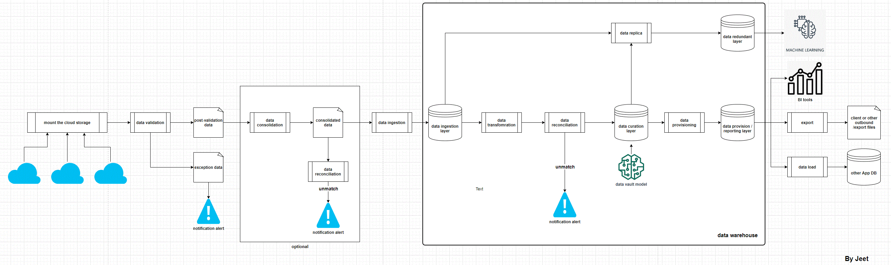

# Data Pipeline Platform v1

This version of the platform contains the fowllowing functions:

* The common util functions which includes print log, execute SQL on DB, send notification
* Check the existence of the required source data files
* Validate the data of the source files based on the certain rules and expectations
* Consolidate post-validation source files into single source file with header
* Parallel process 
* Ingest source files into ingestion layer and popualte delta data
* Perform curation layer by using Data Vault Model


Some other functions could be added in the future version like reconcilidation check, exception data file population, data redundant and replica, and data prcoess track
<br><br><br><br>


## Platform Content

This platform is mainly built in **python** language and the open source **SQLite3** is used as the DB for all the tables.
<br><br><br><br>


### Required libraries 

 * sqlite3 - (SQLite3 reference: https://www.sqlite.org/datatype3.html), note. SQLite3 does not have boolean, date and time data type, hence, the text(like string or varch) is used instead.
 * boto3 - AWS services library, here SNS was used for sending email notifcaitions which includes success, warning and failure Notifcation.
 * glob - This was used in this platform for listing and finding the raw source files, the main feature used here is file name wildcards.
 * pandas - Store data in dataframe for wild a range of use cases.
 * concurrent.futures  - This was used for performing parallel job exectuion.

Run command **pip install <library>** to install required python libraries.
<br><br><br><br>


### Platform Code Structure 

In design of the code, 2 main things were always under consideration:
   * Each of the source code was developed as a micro-service, which means it can be simply copied to other python platform to achive the functionality.
   * To reduce the frenquency of changing source code, control tables were introduced to manage the majority of the logics, e.g. in curation layer, if any join logic changes we only need to update 1 record from the contorl table instead of chagne the pipeline code.
<br><br><br>


1. Main code src/data_pipeline_orchestration.py
    This is the main code which manages the orchestration process by executing each data pipeline/process in designed order.
<br><br>

2. The util code data_pipeline_util.py <br>
    This code contains some common functions
    * print_log() - this print the log in a nice format [log time] - [log levl] - [log information] e.g. [2022-08-04 14:27:57] - INFO - File Existence Check Process Starts...
    * query_db() - this function will receive DB and SQL as 2 parameters and execute the SQL on the DB. It will return query results OR excute DML. 
    * send_notification() - this function will receive 3 parameters (notification level, notification subject and notification message), and sends email notifications by calling the AWS SNS service.
<br><br>

3. Source data file existence check code src/data_file_existence_check.py
    This code is called by the orchestration process, and performs raw source file(s) existence check.
    A control table control_source_file_details will be referred to perform the checks, like number of partitions of the file required and whether if mandatory, etc.
<br><br>

4. Source file validation src/data_file_validation.py
    This code will validate each of the single record in the source file(s) by referring the control table control_source_file_data_validation e.g. file header check, number of columns check, primary key check, etc.
<br><br>

5. Data file consolidation src/data_file_consolidation.py
    This code will merge all the post-validation partitioned files into a single file with header, as the transaction historical data was split into 30GB files from 600GB.
<br><br>

6. Ingestion layer in main orchestration code and src/data_parallel_processes.py
    In the ingestion layer, all the tables (ingestion, delta and stage) are in the similar strucutre of the source file.
    Process will load all the source files to ingestion tables accordingly in parrallel.
    It compares the just loaded ingestion table data with the existing full snapshot staging table data, the changes data will be populated into delta tables. Delta data will be marked as 3 categories: I - insert (new data), U - update, D - delete data.
<br><br>

7. Curation layer in main orchestration code and src/data_parallel_processes.py
    In curation layer, I use data vault modeling, in this model, all the data were stored in 3 type of tables: hubs, links and Satellites
    Merchant data will be updated once we receive the latest file.
    The entire curation process is managed by a control table control_curation_stream, both target curation table and corresponding DML queries were stored in it, so that in the future if any changes, we do not need to make any change on the code but only update 1 record of this table.<br>

    Curation sample tables which can be used for analysts and data scientists 
    Note. DB or table replica can be used for scientists to run their own tranning, supervised learning or other modeling. And Provision layer can be built for BI tools or analytics purpose.
```
        curation_transaction_historical_hub (
		transaction_id integer not null,
		transaction_amount integer not null,
		transaction_date text not null,
		created_date text not null
	),

	curation_merchant_details_hub (
		merchant_id integer not null,
		created_date text not null
	),

	curation_transaction_merchant_link (
		transaction_id integer not null,
		payer_merchant_id integer not null,
		payee_merchant_id integer not null,
		created_date text not null
	),
	
	curation_transaction_historical_sat (
		transaction_id integer not null,
		transaction_amount integer not null,
		transaction_date text not null,
		created_date text not null,
		transaction_approved text not null,
		transcation_status text not null,
		created_date text not null
	)
		,
	curation_merchant_details_sat (
		merchant_id integer not null,
		merchant_company_name text,
		merchant_first_name text,
		merchant_last_name text,
		merchant_address1 text,
		merchant_address2 text,
		merchant_suburb text,
		merchant_state text,
		merchant_postcode integer,
		merchant_email text,
		merchant_contact_number text,
		created_date text not null
	),
```    
<br><br>


8. One time off (once off) codes in folder /one_time_off_code
    * DB_creation.py  - used to create a new DB
    * tables_creation.py - used to create all the control tables, ingestion tables, curationt ables, etc.
<br><br><br><br><br><br>


## Data Platform CI/CD 

There are 2 ways to mantain the platform CI/CD features.
  * Implement a CI tool (e.g DRONE CI: https://www.drone.io/) so that any changes of this repo that pushed to Github, a new docker image will be created. Then CD tool (e.g. TeamCity) will deploy this new image to K8s with no down time.
  * As the majority of the table logics were stored in control tables, and the python code just works as a framework, thus, any action like add new table, and change table logic can be done by simply adding or updating 1 record from the control table.
<br><br><br><br><br><br>


## High Level Design of the Platform
As the early version, this platform was designed in the below layout.

